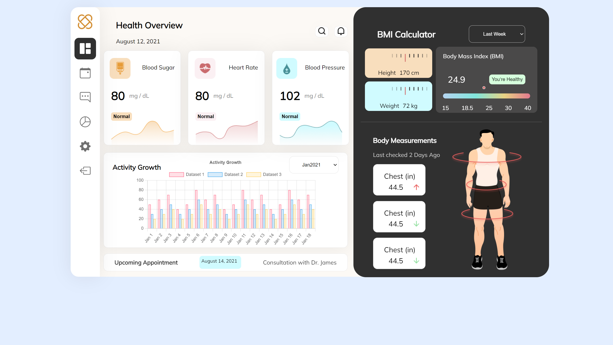

<!-- MARKDOWN 14/05/2024 -->

<div align=center>

# Healthcare Dashboard



</div>

--- 

## Info

## Webpack assembling the project:

#### Enter the `npx webpack` code after changing the webpack code

```bash
npx webpack
```

### This command creates the file `dist/bundle.js`.
